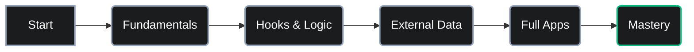

# LEARN-REACT: The Mastery Lab

<p align="center">
  <strong>A collection of 13 projects built to master React, from basic logic to full applications.</strong>
</p>

<p align="center">
  This repository documents my journey of learning React. Instead of just reading, I built real things—learning how to handle data, manage state, and create clean user interfaces step-by-step.
</p>

<p align="center">
  
  
  
  
</p>

---

## Table of Contents

- [The Architecture of Learning](#the-architecture-of-learning)
- [Projects & Learning Path](#projects--learning-path)
- [The Technology Stack](#the-technology-stack)
- [How to Explore These Projects](#how-to-explore-these-projects)
- [License](#license)
- [Developed & Documented by](#developed--documented-by)

---

## The Architecture of Learning
This diagram shows how I moved from learning the core basics to building complex, real-world systems.



---

## Projects & Learning Path

A collection of 13 hands-on projects designed to master React. Each module focuses on a specific feature or concept, moving from the basics to building full-scale applications.

| Index | Project Name | What I Focused On | Category |
| :--- | :--- | :--- | :--- |
| **01** | `blog-system-api` | Connecting to APIs and handling data | Data Fetching |
| **02** | `modern-blog-app` | Building a complete, content-rich website | Full-Scale App |
| **03** | `state-management-counter` | Understanding how React updates the UI | Fundamentals |
| **04** | `integrated-form-logic` | Handling user inputs and form validation | Forms & Logic |
| **05** | `developer-portfolio` | Creating a professional, responsive site | Production Ready |
| **06** | `props-foundation-lab` | Passing data smoothly between components | Fundamentals |
| **07** | `dynamic-routing-engine` | Making multi-page apps with links | Navigation |
| **08** | `list-rendering-patterns` | Showing lists of items efficiently | Fundamentals |
| **09** | `task-orchestration-app` | Creating, editing, and deleting items | Productivity |
| **10** | `advanced-task-manager` | Handling complex data and updates | Advanced Logic |
| **11** | `conditional-rendering-lab` | Showing different views based on logic | Fundamentals |
| **12** | `media-gallery-interface` | Building interactive and pretty layouts | UI & Design |
| **13** | `realtime-weather-telemetry` | Getting and showing live weather data | API Integration |
---

## The Technology Stack

These are the primary tools used across all 13 projects to ensure modern performance and clean code.

- **Library:** React 19 (Functional components and hooks)
- **Styling:** Tailwind CSS 4 (Modern, utility-first design)
- **Build Tool:** Vite (Fast development and small bundle sizes)
- **Routing:** React Router (Handling navigation between pages)
- **Data:** Fetch API (Connecting to and managing external data)

---

## How to Explore These Projects
All projects are self-contained. To try one out, follow these steps:

1.  **Prerequisites**
Ensure you have **Node.js** (v18 or higher) and **npm/pnpm** installed.

2.  **Clone the repository**
    ```bash
    git clone https://github.com/abdul-rahman-0x/LEARN-REACT.git
    cd LEARN-REACT
    ```

3.  **Go into a project folder**
    ```bash
    cd 10-advanced-task-manager
    ```

5.  **Install & Run**
    ```bash
    npm install
    npm run dev
    ```

---

## License
This project is open-sourced under the **MIT License**. See the [LICENSE](LICENSE) file for details.

---

## Developed & Documented by 
**[Abdul Rahman](https://github.com/abdul-rahman-0x)**  
